## CS324 Deep Learning Assignment 1 Report

> 11912714 任艺伟

### Part I: the perceptron (20 points)

####  1.1 Task 1 

Generate a dataset of points in R2.To do this, define two Gaussian distributions and sample 200 points from each.Your dataset should then contain a total of 400 points, 200 from each distribution. Keep 160 points per distribution as the training (320 in total), 40 for the test (80 in total).

From SA\`s suggestion, us `numpy.random.normal(loc, scale,size)` to generate Gaussian distribution samples.

```python
x1 = np.random.normal(loc=m1, scale=s1,size=(200,2))
y1 = np.ones((200))
x2 = np.random.normal(loc=m2, scale=s2,size=(200,2))
y2 = -np.ones((200))
```

and at first we let m1,m2 be 2,6 and s1=s2 = 2, use matplotlib.pyplot function to display the distribution.

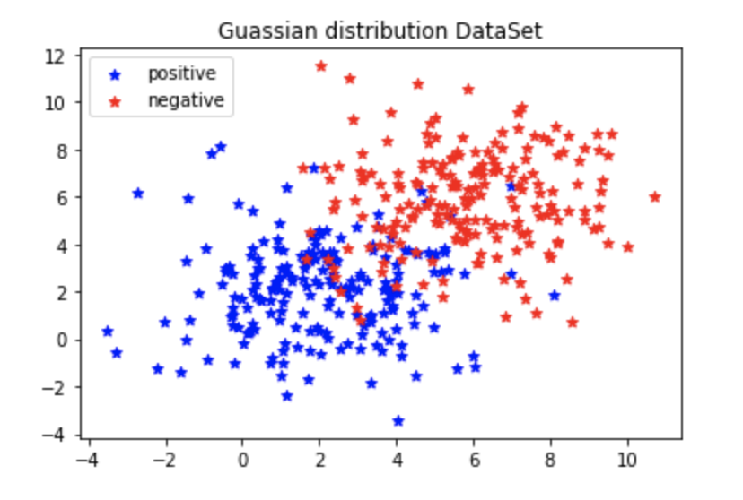

we can find there are two classes positive and negative. and use following codes to separate every class first 160 datas to be training set the left 80 datas in every class to be testing set.

```python
x_train = np.concatenate((x1[:160],x2[:160]), axis = 0)
y_train = np.concatenate((y1[:160],y2[:160]), axis = 0)
x_test = np.concatenate((x1[160:],x2[160:]), axis = 0)
y_test = np.concatenate((y1[160:],y2[160:]), axis = 0)
```

#### 1.2 Task 2

Implement perceptron following the specs in **perceptron.py** and the pseudocode in perceptronslides.pdf.

```python
class Perceptron(object):
    def __init__(self, n_inputs, max_epochs=1e2, learning_rate=1e-2):
      """
        Initializes perceptron object.
        Args:
            n_inputs: number of inputs.
            max_epochs: maximum number of training cycles.
            learning_rate: magnitude of weight changes at each training cycle
        """
              
    def forward(self, input):
        """
        Predict label from input 
        Args:
            input: array of dimension equal to n_inputs.
        """
    def train(self, training_inputs, training_labels, testing_inputs, testing_labels):
       	"""
        Train the perceptron
        Args:
            training_inputs: list of numpy arrays of training points.
            labels: arrays of expected output value for the corresponding point in				   training_inputs.
        """
    def get_test_accu(self):
				"""
        Return accuracy
        """
    def prediction_accuracy(self, testing_inputs, labels):
      	"""
        Do prediction on the testing set
        Args:
            testing_inputs: list of numpy arrays of testing points.
            labels: arrays of expected output value for the corresponding point in tseting_inputs.
        """
```

From above, I implement five classs method in `Percetion class`.

* According n_input, initialize the weight to numpy array and set the value default zero.At this, we make bias to the weight also, so weight shape is (1,len(input)+1)
* When forwarding,  corresponding to weight, we append 1 to input to make its length is also len(input)+1 and do dot product, then sign the product as output of this input
* When training step, in each epoch, for every input we do forwarding and update weight following the slides, also, after one input training, do prediction to get test accuracy.
* In calculate testing accuracy, pass the test set and do forwarding,  count the correctness.

#### 1.3 Task 3

Train the perceptron on the training data (320 points) and test in on the remaining 80 test points. Compute theclassification accuracy on the test set.

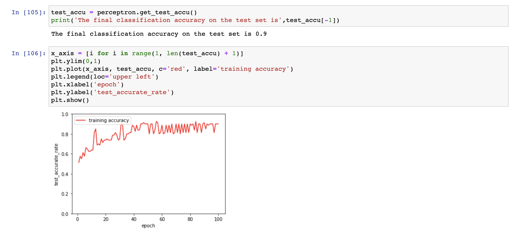

I use jupyter notebook to traing the data and do test, find the final accuracy is 0.9. And we can see the total tendecy of curve is go upward, the accuracy is improved.and it converge to 0.9 nearby.


#### 1.4 Task 4

Experiment with different sets of points (generated as described in Task 1). What happens during training if the means of the two Gaussians are too close and/or if their variance is too high?

we look at the function of generate Gaussian distribution samples

> numpy.random.normal(loc,scale,size)`

there are tow important parameters, since size is same in our experiment. I divide them to two test, fix one parameter and change the means to  look the situation of the means of the two Gaussians are too close and/or.

```python
m1 = ini_m2 = 2
perceptron = Perceptron(320)
accu_change = []
for delta in range(10):
    m2 = ini_m2+delta
    x1,x2,y1,y2 = generate(m1,2,m2,2)
    x_train = np.concatenate((x1[:160],x2[:160]), axis = 0)
    y_train = np.concatenate((y1[:160],y2[:160]), axis = 0)
    x_test = np.concatenate((x1[160:],x2[160:]), axis = 0)
    y_test = np.concatenate((y1[160:],y2[160:]), axis = 0)
    
    perceptron.train(x_train, y_train, x_test, y_test)
    accu_change.append(perceptron.get_test_accu()[-1])
```

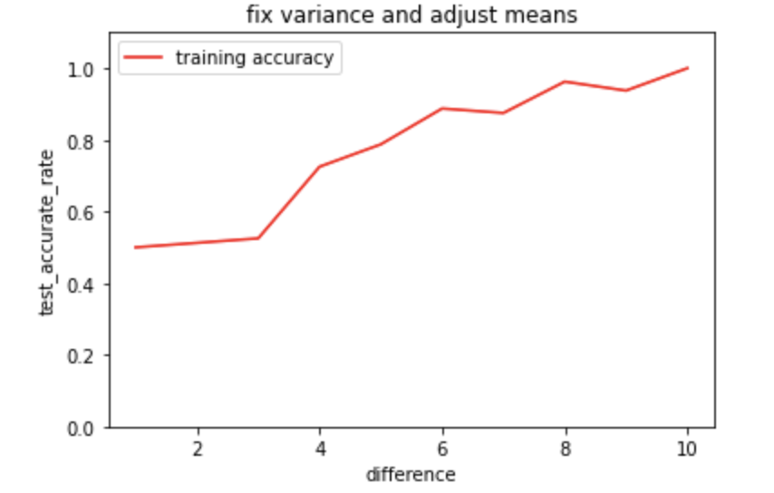

According to result, it is easy to find that when the means of the two Gaussians are too close, the two distribution is too similar and the accuracy is 0.5, like randomly. when they are not close, the rate increases since two classes sperate more.

For their variance is too high, really similar to above.

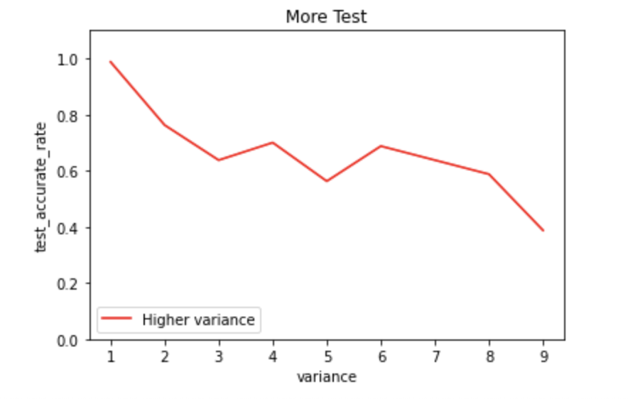

we can find the variance become bigger and the accuracy is decreased. Since the data points are distributed discretely, with large variance and wide dispersion, and have great influence on each other


### How to run

* **perceptron.py ** we define a class called Perception, provide above five methods, and a function generation to generate dataset.
* **perceptionTest.ipynb** A jupyter notebook to test my Percepron class, provide generate dataset and train, get accuracy and some plot codes.


###  Part II: the mutli-layer perceptron (65 points)

#### 2.1 Task 1

Implement the MLP architecture by completing the files **mlp_numpy.py** and **modules.py**.

> **modules.py**.

In this python file, define **Linear**, **RELU**,**Softmax**,**CrossEntropy** class model for multi-layer perceptron.In each model, from cs231n course lab introduction and code frame, each part is to be defined for two parts **forwarding** and **backwarding**.In forwarding step, implement operation on input from training data or last lyer and caluculate the output according to this layer characteric to next layer or prediction output.And In backwarding step, after calculate loss of prediction and target, backward to record the gradient in every layer for latter adjust the weight in the Linear layer. I wil discuss some details of each model.

**Linear**

* `def __init__(self, in_features, out_features)` 

  **init** function to declare variables which will be used in the forward and backward, such as  the **input feature** and **out feature**, the **weight( shape is (in_ feature,out_feature)) **the **bias(shape is (1,out_feature))** and the **grads** of weight in bias and more.

* `def forward(self, x)`

  * first record input to be used in latter for backward

  * according to the formula, do dot product and add bias to caluculate layer output.

    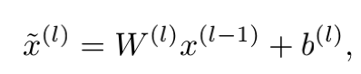

* `def backward(self, dout)`

  * Compute the grads of weight and bias, in this step, i do accumulate sub to record one batch grads total.
    * G<sub>b</sub> += dout
    * G<sub>w</sub> += x.T * dout (* is dot product, T is transport)
  * Compute the input grads to give to last layer as out.
    * dx = dout * weight.T

**RELU** && **Softmax**

There are two activate function layers, to transfer out put of Linear layer to avoid all linear multiply. Its structure is really same defined to linear layer.

> RELU formula

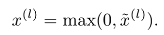

> Softmax formula

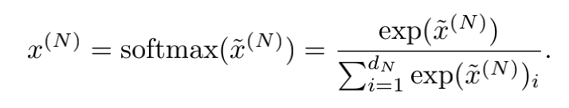

In the forwarding  relu, use numpy.maximum() function to make negative value to zero, and for grads,and backwarding if x postive, grads is 1, and for input negative item, grads is 0.

In the forwarding software, learn by SA`s suggestion to avoid error. and the backwarding, i comined with crossentroy together.

**CrossEntropy**

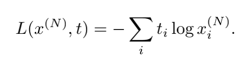

acccording this formula to caluculate by numpy,if we combine crossEntropy and softmax layer backward together, after calculate can find for one input training data, the grads is input to crossEntrop which is the prediction of layers substract ture label dout = y_out - target

> mlp_numpy.py

```python
class MLP(object):
    def __init__(self, n_inputs, n_hidden, n_classes, rate):
    
    def forward(self, x):

    def lossFunction(self,label):

    def backward(self):

    def clear_descent(self):

    def upadte_parameters(self, size=1):    
```

 In the `mlp_numpy.py`, define above methods, like perception.py, it also divided into forward backward, adjust parameters part.

* **forward**

  Parse the hidden layer and construct the mlp process. After each layer of the middle layer is output, it is activated by the Relu function, and the last layer is activated by the softmax function.

* **lossFunction**

​		According to CrossFucntion, to calculate the loss of this traing data.

* **backward**

  Calculate the dt of each layer and update the grads in Linear weight and bias.

* **upadte_parameters**

  Update the param weight and bias in Linear according to grads stored.

  For batch part, in every linear layer:

  ```
  					weight = weight - learning_rate * weigth_grads_total / traing_data_length
  					bias = bias - learning_rate * bias_grads_total / traing_data_length
  ```

* **clear_descent**

  Clean the accumlate grads in weight and bias after one update( one epoch )

  

#### 2.2 Task 2

Implement training and testing script in **train mlp numpy.py**. (Please keep 70% of the dataset for training and the remaining 30% for testing. Note that this is a random split of 70% and 30% )

```python
x, y = datasets.make_moons(n_samples=2000, shuffle=True, noise=None, random_state=None)
y = np.reshape(y, (2000, -1))
enc = OneHotEncoder(sparse = False) 
y_onehot = enc.fit_transform(y)
training_inputs = x[:1400]
training_labels = y_onehot[:1400]
testing_inputs = x[1400:]
testing_labels = y_onehot[1400:]
```

I use sklearn to generate datasets.`datasets.make_moons(n_samples=2000, shuffle=True, noise=None, random_state=None)`.Total 2000 data, and make shuffle true to random generate to satisfy the random spilt training data and testing data.

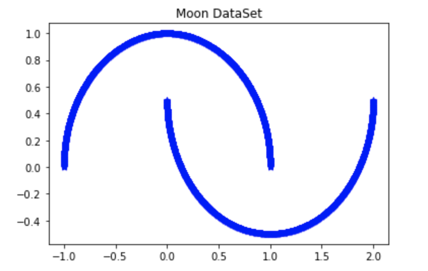

then like perctron to implement epoch training use BGD to update params. when up to frequence of test, test the accuracy of both training and testing data and plot, i don`t  discuss the details of this.


#### 2.3 Task 3

Using the default values of the parameters, report the results of your experiments using  jupyter notebook where you show the accuracy curves for both training and test data.

> use jupyter notebook to training and print some information of midterm accuracy

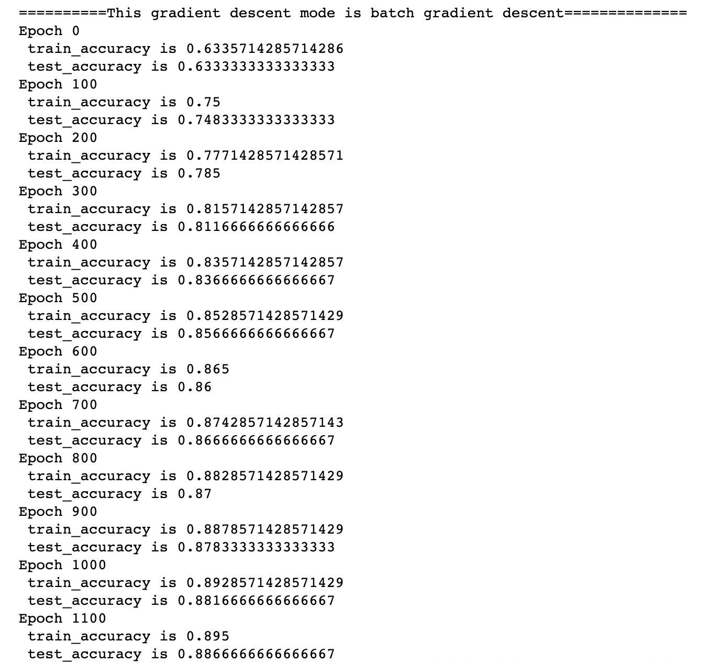

>Use plot to draw the accuracy change curve the axis is epoch/10 to display more beautiful

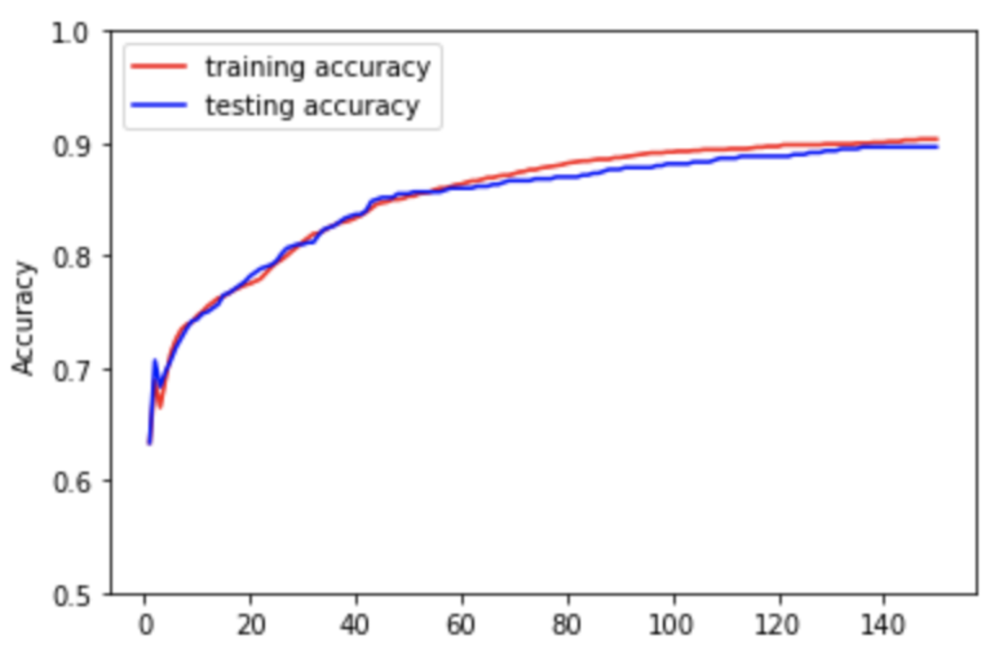

**BGD Analysis**

In this training, use the default parameters, for learning rate is 0.01, and epoch is total 1500, accuracy frequency is 10.from the result, we can find :

* the training and testing tendency are consistent and going up, out accuracy is increasing when training.
* the increasing tendency is smooth, not boom increases
* the accuracy corvage to 0.9 and can not improve at latter epoch
* if run serval times, the first accuracy is different, since we update weight after one epoch, so the first accuracy may different much since the initial weight are random normal maybe not fit.
* What`s  more, I want to increase the accuracy, just try to increase leaning rate to 0.1 and test again. And the result is perfect, it converge speed improve and up to 1.0!!

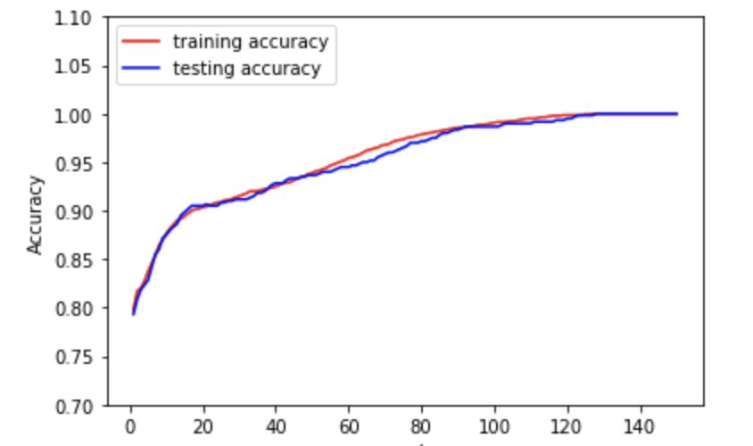

###  Part III: stochastic gradient descent (15 points)

#### 3.1 Task 1

Modify the train method in **train mlp numpy.py** to accept a parameter that allows the user to specify if the

training has to be performed using batch gradient descent (which you should have implemented in Part II) or stochastic gradient descent.

```python
parser.add_argument('--gradient_descent_mode', type=str, default = GRADIENT_DESCENT_MODE,
                          help='gradient descent mode of training')
```

first we add one arguement called gradient_descent_mode and type is str to represent the mode of gradient descent, if it is `batch`, BGD, if `stochastic` SGD.


What`s more, there are some difference between BGD and SGD

* BGD update params after one epoch —— batch update
* SGD update params after one traing data —— even update

I want to use following simplfy code to represent the change in numpy.py

```python
for epoch in range(FLAGS.max_steps):
        for index, training_input in enumerate(training_inputs):
            if descent == 'stochastic':
                mlp.clear_descent()
            # forwarding and backwarding is the same
            training_label = training_labels[index]
            mlp.forward(training_input)
            mlp.lossFunction(training_label)
            mlp.backward()
            
            if descent == 'stochastic':
                mlp.upadte_parameters()       
        if descent == 'batch':
            mlp.upadte_parameters(len(training_inputs))
            mlp.clear_descent()
```


Yes! if mode is BGD, after one epoch to update, and if mode is SGD, after one traing to update, and also need to clear the accumlate gd in params.


#### 3.2 Task 2

Using the default values of the parameters, report the results of your experiments using a jupyter notebook where you show the accuracy curves for both training and test data.

> print midterm accuracy

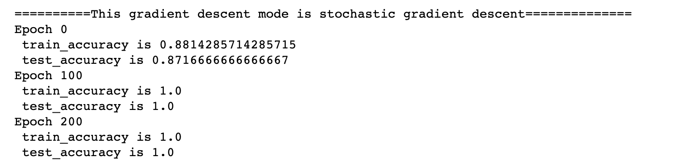

> plt the accuracy curve

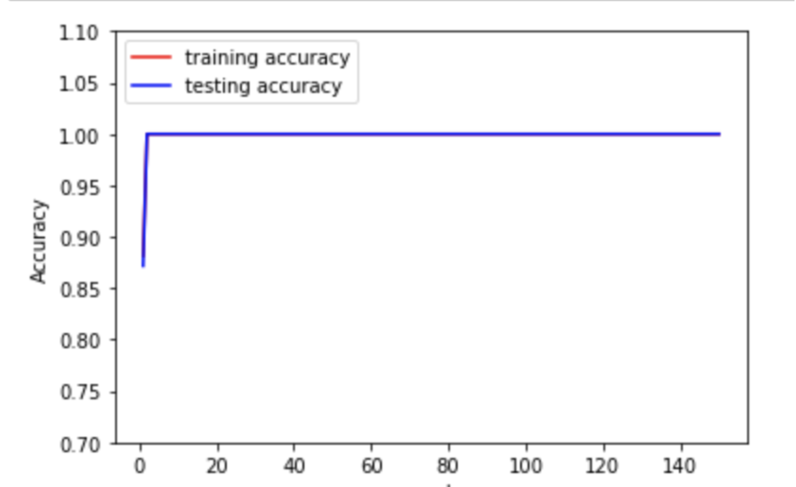

**SGD Analysis**

In this training, also  use the default parameters, for learning rate is 0.01, and epoch is total 1500, accuracy frequency is 10.from the result, we can find :

* the training and testing tendencyof SGD are consistent and going up, out accuracy is increasing when training.
* the increasing tendency of SGD is boom corressponding to BGD
* the accuracy of SGD corvage up to 1.0 with same learning rate of BGD
* if run serval times, the first accuracy is similar, since we update weight after every training data, so one epoch after, it has updated many times and up to certainly accuracy, will not different so much as BGD
* What`s more, not display on the picture, SGD compare to BGD, since every update params, so it may caused more shocks, and the accuracy rate drops and rises.


### How to run

* `modules.py` `mlp_numpy.py` two model python file, define some classes and method.

* `train_mlp_numpy.py` training and result display.

  use argparse.ArgumentParser() to read arguments

```python
parser.add_argument('--dnn_hidden_units', type = str, default = DNN_HIDDEN_UNITS_DEFAULT,
                  help='Comma separated list of number of units in each hidden layer')
parser.add_argument('--learning_rate', type = float, default = LEARNING_RATE_DEFAULT,
                  help='Learning rate')
parser.add_argument('--max_steps', type = int, default = MAX_EPOCHS_DEFAULT,
                  help='Number of epochs to run trainer.')
parser.add_argument('--eval_freq', type=int, default=EVAL_FREQ_DEFAULT,
                      help='Frequency of evaluation on the test set')
parser.add_argument('--gradient_descent_mode', type=str, default = GRADIENT_DESCENT_MODE,
                      help='gradient descent mode of training')
FLAGS, unparsed = parser.parse_known_args()
```

And we can use like  `%run train_mlp_numpy.py --gradient_descent_mode='batch'  `to run the program in jypter notebook all just same way params use in command line python 

* `MLP.ipynb` some test to finish above task and also to run train_mlp_numpy.py